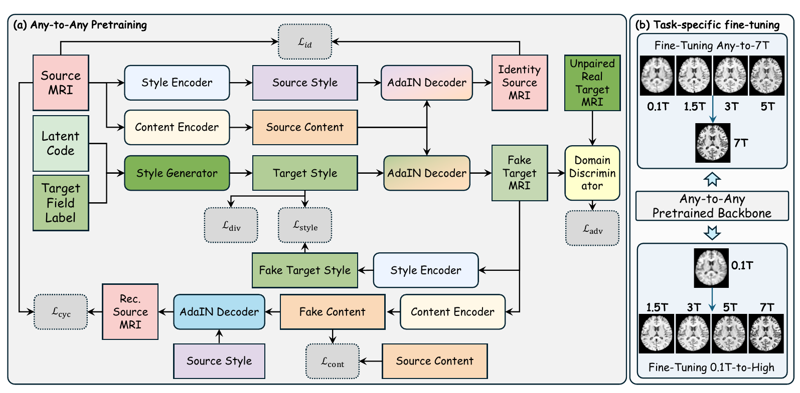

# 3D MRI Field-Strength Translation

PyTorch implementation of **Task-Adaptive 3D Cross-Field MRI Translation via Field-Conditioned Content-Style Pretraining**, developed for the *MRIxFields 2026 Challenge*.

The framework learns unpaired 3D MRI translation by separating anatomical content from field-dependent appearance. A field-conditioned content-style backbone supports Any-to-Any translation and is adapted to Any-to-7T synthesis and 0.1T-to-High enhancement. It covers five field strengths (0.1T, 1.5T, 3T, 5T, and 7T) and three modalities (T1W, T2W, and T2FLAIR), with separate models for each modality.



*Figure 1. Field-conditioned Any-to-Any pretraining and task-specific fine-tuning for Any-to-7T synthesis and 0.1T-to-High enhancement.*

## Dependencies

Python 3.10 and a CUDA-enabled PyTorch installation are recommended. Dependencies are PyTorch, NiBabel, NumPy, and tqdm:

```bash
pip install -r requirements.txt
```

Use a PyTorch build compatible with your CUDA environment that supports `torch.amp.GradScaler("cuda", ...)` and `torch.amp.autocast`, as used by the training scripts.

## Training and Testing

### Data preparation

Obtain the data from the [MRIxFields 2026 Challenge](https://mrixfields.chihucloud.com/2026/) and organize NIfTI volumes (`*.nii.gz`) as follows:

```text
Dataset/
  <MODALITY>/
    <SPLIT>/
      <FIELD>/
        *.nii.gz
```

Use `T1W`, `T2W`, or `T2FLAIR` for `<MODALITY>`; `Training`, `Validation`, or `Testing` for `<SPLIT>`; and `0.1T`, `1.5T`, `3T`, `5T`, or `7T` for `<FIELD>`. Run all commands below from the repository root. The examples use T1W; repeat with the other modalities and matching output directories.

### Training

First train the Task 3 Any-to-Any backbone using unpaired 3D patches:

```bash
python train_murd3d.py --data-root Dataset --modality T1W --output-dir outputs/murd3d_T1W --mixed-precision
```

Then initialize Task 1 and Task 2 from the matching backbone checkpoint:

```bash
# Task 1: Any-to-7T
python train_task1_finetune.py --data-root Dataset --modality T1W --pretrained outputs/murd3d_T1W/latest.pt --output-dir outputs/task1_T1W_finetune --mixed-precision

# Task 2: 0.1T-to-High
python train_task2_finetune.py --data-root Dataset --modality T1W --pretrained outputs/murd3d_T1W/latest.pt --output-dir outputs/task2_T1W_finetune --mixed-precision
```

For multi-GPU training, replace `python` with `torchrun --standalone --nproc_per_node=2` (adjust the GPU count as needed). `--batch-size` is per GPU. Adjust `--patch-size`, `--steps`, and `--batch-size` for your resources; use each script's `--help` for all options. Checkpoints are saved as `latest.pt` in the specified output directory.

### Testing

Testing uses full-volume sliding-window inference on the `Testing` split by default:

```bash
# Task 1: Any-to-7T
python infer_task1.py --data-root Dataset --modality T1W --checkpoint outputs/task1_T1W_finetune/latest.pt --output-dir outputs/task1_T1W

# Task 2: 0.1T-to-High
python infer_task2.py --data-root Dataset --modality T1W --checkpoint outputs/task2_T1W_finetune/latest.pt --output-dir outputs/task2_T1W

# Task 3: Any-to-Any
python infer_murd3d.py --data-root Dataset --modality T1W --checkpoint outputs/murd3d_T1W/latest.pt --task task3 --output-dir outputs/task3_T1W
```

Task 2 can be restricted to a target with `--target-fields 7T`. For Task 3, use `--source-fields` and `--target-fields` to select translation directions. Adjust `--overlap` and inference `--batch-size` to control sliding-window processing. Generated NIfTI volumes are written under `--output-dir`. Use your own trained checkpoints; data and model weights are not included in the repository.

## Acknowledgement

We thank the MRIxFields 2026 Challenge organizers and data contributors, and the maintainers of PyTorch, NiBabel, NumPy, and tqdm. The framework builds on content-style representation disentanglement and adaptive instance normalization.

## Citation

If you find this work useful, please cite the manuscript:

```bibtex
@misc{pang2026taskadaptive,
  title  = {Task-Adaptive {3D} Cross-Field {MRI} Translation via Field-Conditioned Content-Style Pretraining},
  author = {Pang, Haowen and Hao, Yingqi and Zhu, Pengli},
  year   = {2026},
  note   = {MRIxFields 2026 challenge manuscript},
  url    = {https://github.com/Idea89560041/3D-MRI-Field-Translation}
}
```
